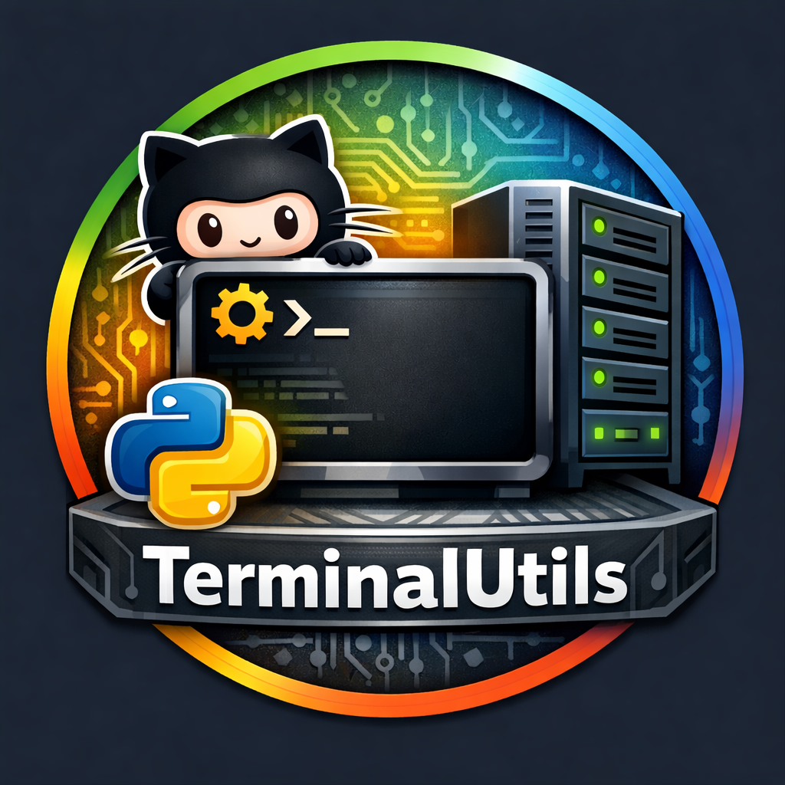

# TerminalUtils



Lightweight cross-platform utilities to manage servers and GitHub repositories from the terminal.

[](https://github.com/XXanderWP/TerminalUtils/releases/latest)
[](https://www.microsoft.com/windows)
[](https://developer.apple.com/macos/)
[](http://linux.com/)
[](https://nodejs.org/)
[](LICENSE)

Repository: https://github.com/XXanderWP/TerminalUtils

## Overview

This project contains small helpers and a simple interactive menu to perform frequent tasks:
- connect to SSH servers,
- create and merge GitHub pull requests (via GitHub REST API),
- bump project versions for Node.js, Python-style `pyproject.toml`, or plain `VERSION` projects.

All interactive scripts are implemented in Node.js and run in TUI format in the terminal (via `inquirer` and terminal UI styling). Platform-specific launchers for Unix (`.sh`) and Windows PowerShell (`.ps1`) are included.

## Key files

- Main menu (Node.js): [`util-handler.js`](util-handler.js:1)
- Unix launcher: [`util.sh`](util.sh:1)
- PowerShell launcher: [`util.ps1`](util.ps1:1)
- SSH helper: [`ssh-servers-handler.js`](ssh-servers-handler.js:1)
- Servers data (externalized): [`servers.txt`](servers.txt:1)
- Upload / PR helper: [`upload-handler.js`](upload-handler.js:1) and wrappers [`upload.sh`](upload.sh:1), [`upload.ps1`](upload.ps1:1)
- Version bump helper: [`new-version.js`](new-version.js:1) and wrappers [`new-version.sh`](new-version.sh:1), [`new-version.ps1`](new-version.ps1:1)
- Update checker: [`update-check.js`](update-check.js:1)
- Repo configuration loader: [`repos.js`](repos.js:1)

## Requirements

- Node.js 18+
- Install dependencies:

```bash
npm install
```

- External tools used by features:
  - git
  - ssh
  - npm
  - `GITHUB_TOKEN` (or `GH_TOKEN`) environment variable for GitHub API operations

### GitHub Authorization

The upload/PR helper (`upload-handler.js`) calls GitHub REST API directly.

You now have two ways to authorize:

```bash
export GITHUB_TOKEN="your_token"
```

or open the built-in TUI menu and use `GitHub authorization` to paste and save a token locally in `~/.terminalutils/github-auth.json`.

Recommended permissions:

```text
Classic token: repo
Fine-grained token: Pull requests (read/write), Contents (read/write), Metadata (read)
```

## Usage

Run interactively from repository root:

```bash
node util-handler.js
# or use the platform launcher
./util.sh         # Unix-like
util.ps1          # PowerShell
```

The launcher scripts forward command-line arguments to the Node.js menu and try to use the `NODE` environment variable when set.

## Automatic installer (one-liners)

You can install TerminalUtils automatically using the provided installer scripts. These one-liners fetch the latest installer from the repository and execute it.

Unix (Linux / macOS):

```bash
# download and run the installer (inspect the script before running)
curl -sSL https://raw.githubusercontent.com/XXanderWP/TerminalUtils/main/install.sh | bash
```

PowerShell (Windows):

```powershell
# download and run the installer (inspect the script before running)
irm https://raw.githubusercontent.com/XXanderWP/TerminalUtils/main/install.ps1 | iex
```

The installers are:
- [`install.sh`](install.sh:1) — installer for Linux/macOS
- [`install.ps1`](install.ps1:1) — installer for Windows PowerShell

Security note: Always inspect remote install scripts before executing them on your machine.

## Make available globally

Option A — add repository to PATH (recommended):

Linux / macOS (add to `~/.bashrc` or `~/.zshrc`):

```bash
export PATH="$PATH:/path/to/this/repo"
```

Windows (PowerShell quick example; prefer editing System Environment Variables):

```powershell
setx PATH "$env:PATH;C:\path\to\this\repo"
```

Option B — alias (personal use):

```bash
alias util='/path/to/repo/util.sh'
```

PowerShell (add to your PowerShell profile):

```powershell
function util { param($args) & 'C:\path\to\repo\util.ps1' @args }
```

## Servers configuration

The SSH helper reads servers from [`servers.txt`](servers.txt:1). Format:

```
Display Name|user@host.example.com
# Comments start with '#'
```

Keep [`servers.txt`](servers.txt:1) protected if it contains sensitive hostnames.

## Contributing

If you plan to extend the project:
- add tests and a CI workflow (GitHub Actions),
- include a license and CHANGELOG,
- consider adding a single-entry CLI (console_scripts) for pip installation.

## Recent features (implemented)

- Update check and notification system ([`update-check.js`](update-check.js:1)):
  - background_check writes a cache and a flag file `.update_available.json` and runs silently from auxiliary scripts;
  - interactive check (menu) reads latest GitHub release and compares with local [`package.json`](package.json:1) version;
  - caching prevents checks more often than every 5 minutes.

- Cross-script notifications:
  - auxiliary scripts (e.g. [`upload-handler.js`](upload-handler.js:1), [`new-version.js`](new-version.js:1), [`ssh-servers-handler.js`](ssh-servers-handler.js:1)) perform a background check and notify the user if an update is available (message suggests to open main utility and use "Check for updates").

 - Repository configuration is stored in JSON ([`repos.json`](repos.json:1)) and loaded by [`repos.js`](repos.js:1). The upload helper can add detected repositories to this JSON and the menu presents repository -> branch-pair selection.

- SSH helper improvements ([`ssh-servers-handler.js`](ssh-servers-handler.js:1)):
  - servers stored in [`servers.txt`](servers.txt:1) can include an optional password field (Display|user@host|password). Adding hosts now asks for host, user (required) and optional password.
  - Password-aware connection: uses `sshpass` on Unix or `plink` on Windows if password is provided; otherwise uses normal `ssh` (keys encouraged).
  - Detects host key mismatch and offers to remove the `known_hosts` entry (uses `ssh-keygen -R` or manual removal) and retry the connection.
  - A menu action to clear entire `~/.ssh/known_hosts` with an explicit confirmation.


## License

This project is licensed under the MIT License — see the [`LICENSE`](LICENSE:1) file for details.
